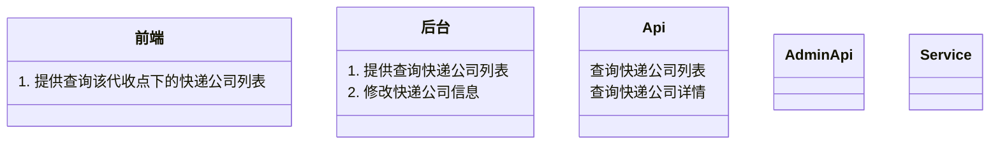
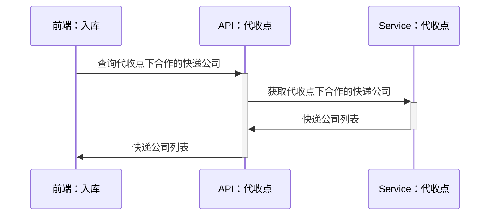
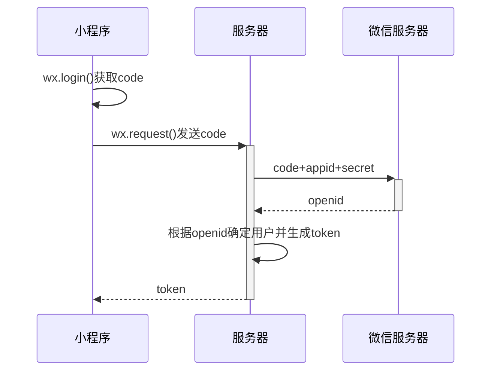

- **快递公司模块**
1. 子模块

```mermaid
classDiagram
    class 前端
    前端: 1. 提供查询该代收点下的快递公司列表
    class 后台
    后台: 1. 提供查询快递公司列表
    后台: 2. 修改快递公司信息
    class Api
    Api: 查询快递公司列表
    Api: 查询快递公司详情
    class AdminApi
    class Service
```
1. 入库流程

```mermaid
sequenceDiagram
    前端：入库 ->> + API：代收点 : 查询代收点下合作的快递公司
    API：代收点 ->> + Service：代收点 : 获取代收点下合作的快递公司
    Service：代收点 ->> - API：代收点: 快递公司列表
    API：代收点 ->> - 前端：入库: 快递公司列表
```

```mermaid
sequenceDiagram
    小程序 ->> 小程序 : wx.login()获取code
    小程序 ->> + 服务器 : wx.request()发送code
    服务器 ->> + 微信服务器 : code+appid+secret
    微信服务器 -->> - 服务器 : openid
    服务器 ->> 服务器 : 根据openid确定用户并生成token
    服务器 -->> - 小程序 : token
```